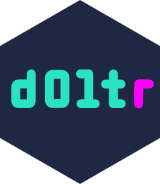

# doltr <a href='https://ecohealthalliance.github.io/doltr'></a>

<!-- badges: start -->
[](https://github.com/ecohealthalliance/doltr/actions)
[](https://www.repostatus.org/#wip)
[](https://www.gnu.org/licenses/agpl-3.0.en.html)
[](https://codecov.io/gh/ecohealthalliance/doltr?branch=main)
<!-- badges: end -->

doltr is a client for [dolt](https://www.dolthub.com), an SQL database with
git-like versioning.  It is a work in progress, not fully documented, and
the API isn't fully baked yet.

## Installation

You will need dolt installed on your machine.  Get it 
[here](https://docs.dolthub.com/getting-started/installation).

Install the R package with 

``` r
remotes::install_github("ecohealthalliance/doltr")
```

# Usage

The package provides two DBI-compliant drivers to connect to a dolt database.
`dolt_remote()` connects to a dolt server via TCP.  `dolt_local()` connects
to a local database directory. (Behind the scenes `dolt_local()` launches and
manages a background server process, which can also be done manually with `dolt_server()`).

`dolt()` serves a connection that is cached during the R session and connects
via default parameters than can be defined via environment variables. (See
`?config`).  

`dolt_pane()` Provides an RStudio connection pane showing the database.

A variety of `dolt_*` functions provide database information and versioning capability.
See help files and [dolt documentation](https://docs.dolthub.com/interfaces/sql).


## Code of Conduct
  
Please note that the dolt project is released with a [Contributor Code of Conduct](https://contributor-covenant.org/version/2/0/CODE_OF_CONDUCT.html). By contributing to this project, you agree to abide by its terms.
